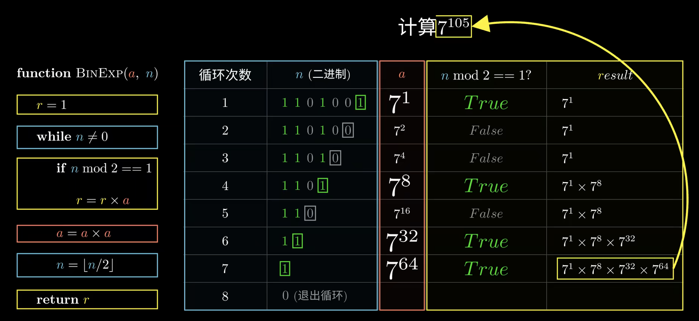

# 快速幂
## 快速幂的概念

快速幂是一种高效的求解大数幂运算的算法。相比于传统的连乘方式，快速幂算法能够大大提高求解的速度，尤其是在处理大数的幂运算时。

## 解决的问题

在进行大数的幂运算时（即a^b），如果直接使用传统的连乘方式，会因为运算次数过多而导致效率低下。例如，计算a的n次方，传统的方法需要进行n-1次乘法运算。而快速幂算法则可以在O(logn)的时间复杂度内完成这样的运算，极大地提高了效率。

## 原理

快速幂的核心思想是“分治思想”和二进制的应用。我们知道，任何一个非负整数n都可以表示为二进制的形式。例如，13可以表示为1101。这样，a的13次方就可以表示为a^(2^3) * a^(2^2) * a^(2^0)。这样，我们就将原问题转化为求解a的1次方，2次方，4次方，8次方的问题，大大减少了运算的次数。


上图伪代码函数入参，其中a为底数，n为指数。

## 实现
+ 快速幂实现
```cpp
int64_t QuickPow(int64_t base, int64_t exponent) {

    int64_t result = 1;
    while (exponent > 0) {
        if (exponent & 1) {
            result *= base;
        }
        base = base * base;
        exponent >>= 1;
    }
    return result;

}
```

+ 幂取模实现
```cpp
int64_t QuickPowWithMod(int64_t base, int64_t exponent, int64_t mod) {
    int64_t result = 1;
    base %= mod;
    while (exponent > 0) {
        if (exponent & 1) {
            result = (result * base) % mod;
        }
        base = (base * base) % mod;
        exponent >>= 1;
    }
    return result;
}
```
依据是《模运算的乘法分配律》：a ≥ 0, n ≥ 0, m > 0，有 (a * n) mod m = ((a mod m) * (n mod m)) mod m。
